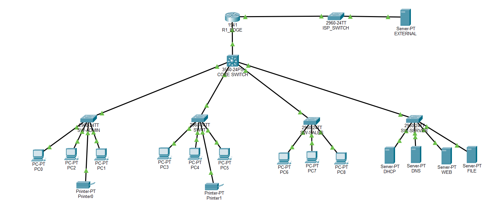

# Enterprise Client-Server Network Infrastructure with VLANs, DHCP, DNS, and NAT/PAT

## Project Overview

This project demonstrates the design and implementation of an enterprise-style network using Cisco Packet Tracer. The network supports multiple departments, centralized network services, inter-VLAN[...]

The project was designed to simulate a small-to-medium business environment with separate networks for Administration, IT, Sales, Servers, and Network Management.

The network uses a Cisco Layer 3 switch for internal routing and an edge router for external connectivity and Network Address Translation (NAT/PAT).

---

## Technologies and Concepts Used

- This project demonstrates the following networking technologies:

  - IPv4 Addressing
  - Subnetting
  - VLANs
  - Access Ports
  - Trunking
  - Layer 2 Switching
  - Layer 3 Switching
  - Switch Virtual Interfaces (SVIs)
  - Inter-VLAN Routing
  - Static Routing
  - Default Routing
  - DHCP
  - DHCP Relay
  - DNS
  - HTTP
  - FTP
  - SSH
  - NAT
  - PAT
  - Network Device Management
  - Network Printers
  - Network Troubleshooting

# Network Topology

```text
                              EXTERNAL NETWORK
                                    
                              EXTERNAL-SERVER
                                     |
                                ISP-SWITCH
                                     |
                              203.0.113.0/24
                                     |
                                 R1-EDGE
                              NAT / PAT
                                     |
                                10.0.0.0/30
                                     |
                                  L3-SW1
                           Layer 3 Core Switch
                                     |
        -------------------------------------------------
        |                |              |               |
     SW-ADMIN          SW-IT         SW-SALES       SW-SERVER
        |                |              |               |
    ADMIN PCs          IT PCs       SALES PCs        Servers
    ADMIN Printer      IT Printer                    DHCP Server
                                                     DNS Server
                                                     Web Server
                                                     File Server
```

 

## Devices Used
# Network Devices
| Device                       | Quantity | Purpose                               |
|------------------------------|----------|---------------------------------------|
| Cisco 3560 Multilayer Switch | 1        | Core switching and inter-VLAN routing |
| Cisco 2960 Switch            | 4        | Access switching                      |
| Cisco Router                 | 1        | Edge routing and NAT/PAT              |
| ISP Switch                   | 1        | External network simulation           |

## End Devices
| Device              | Quantity |
|---------------------|----------|
| Administration PCs  | 3        |
| IT PCs              | 3        |
| Sales PCs           | 3        |
| Network Printers    | 2        |
| DHCP Server         | 1        |
| DNS Server          | 1        |
| Web Server          | 1        |
| File Server         | 1        |
| External Server     | 1        |

## VLAN Configuration

The network is divided into multiple VLANs to separate departments and improve network organization and security.
| VLAN | Name           | Network         | Default Gateway |
|------|----------------|-----------------|-----------------|
| 10   | ADMINISTRATION | 192.168.10.0/24 | 192.168.10.1    |
| 20   | IT             | 192.168.20.0/24 | 192.168.20.1    |
| 30   | SALES          | 192.168.30.0/24 | 192.168.30.1    |
| 40   | SERVERS        | 192.168.40.0/24 | 192.168.40.1    |
| 50   | MANAGEMENT     | 192.168.50.0/24 | 192.168.50.1    |

## IP Addressing Scheme
Administration Department

Network: 192.168.10.0/24
| Device                 | IP Address     |
|------------------------|----------------|
| VLAN 10 Gateway        | 192.168.10.1   |
| Administration Printer | 192.168.10.50  |
| Administration PCs     | DHCP           |

## IT Department

Network: 192.168.20.0/24
| Device        | IP Address     |
|---------------|----------------|
| VLAN 20 Gateway | 192.168.20.1  |
| IT Printer     | 192.168.20.50 |
| IT PCs         | DHCP           |

## Sales Department

Network: 192.168.30.0/24
| Device       | IP Address     |
|--------------|----------------|
| VLAN 30 Gateway | 192.168.30.1 |
| Sales PCs     | DHCP           |


## Server Network

Network: 192.168.40.0/24
| Device      | IP Address     |
|-------------|----------------|
| VLAN 40 Gateway | 192.168.40.1 |
| DHCP Server  | 192.168.40.10 |
| DNS Server   | 192.168.40.11 |
| Web Server   | 192.168.40.20 |
| File Server  | 192.168.40.30 |

## Management Network

Network: 192.168.50.0/24
| Device      | IP Address     |
|-------------|----------------|
| VLAN 50 Gateway | 192.168.50.1 |
| SW-ADMIN     | 192.168.50.10 |
| SW-IT        | 192.168.50.20 |
| SW-SALES     | 192.168.50.30 |
| SW-SERVER    | 192.168.50.40 |

## Edge Router Network

The Layer 3 switch and edge router communicate through a dedicated point-to-point network.

Network: 10.0.0.0/30
| Device  | Interface            | IP Address |
|---------|----------------------|------------|
| L3-SW1  | Routed Port          | 10.0.0.1   |
| R1-EDGE | GigabitEthernet0/0   | 10.0.0.2   |

## External Network

The external network simulates an Internet or ISP environment.

Network: 203.0.113.0/24
| Device          | IP Address    |
|-----------------|---------------|
| R1-EDGE G0/1    | 203.0.113.1   |
| External Server | 203.0.113.10  |
