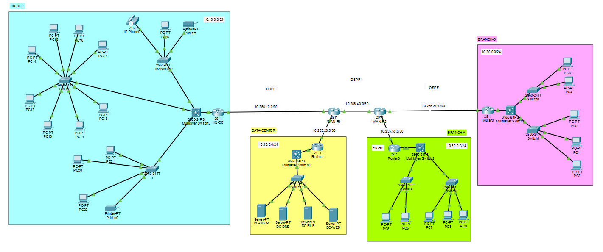

### Enterprise Multi-Site Network Infrastructure

- A Cisco Packet Tracer project simulating the network infrastructure of a multi-site healthcare technology company.

 

## Technologies
        TCP/IP
        VLAN and Inter-VLAN Routing
        DHCP and DNS
        OSPF
        EIGRP
        OSPF/EIGRP Route Redistribution
        Layer 3 Switching
        Cisco IOS Troubleshooting
        Network Sites
        Headquarters
        Las Piñas Branch
        Cavite Branch
        Data Center
        Key Implementation

- The network uses OSPF as the primary enterprise routing protocol while the Cavite branch uses EIGRP. Route redistribution on the Cavite edge router allows communication between the OSPF and EIGRP routing domains.

- The project focuses on practical enterprise network design, configuration, connectivity testing, and troubleshooting using Cisco Packet Tracer.
